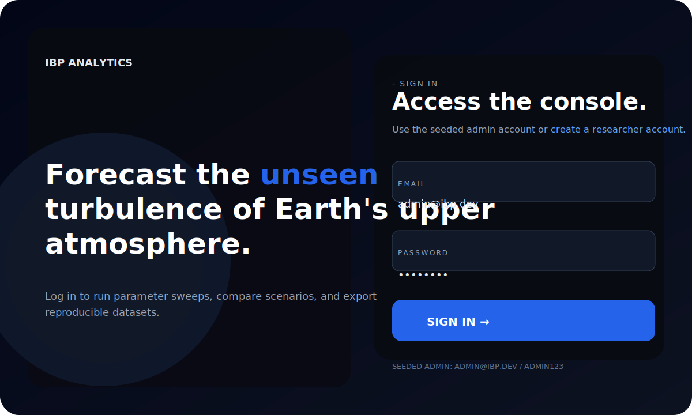
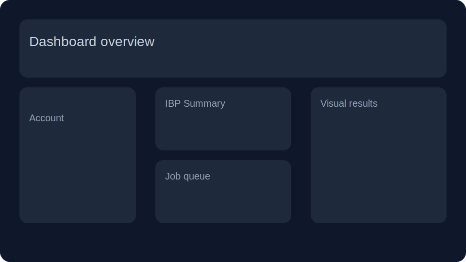
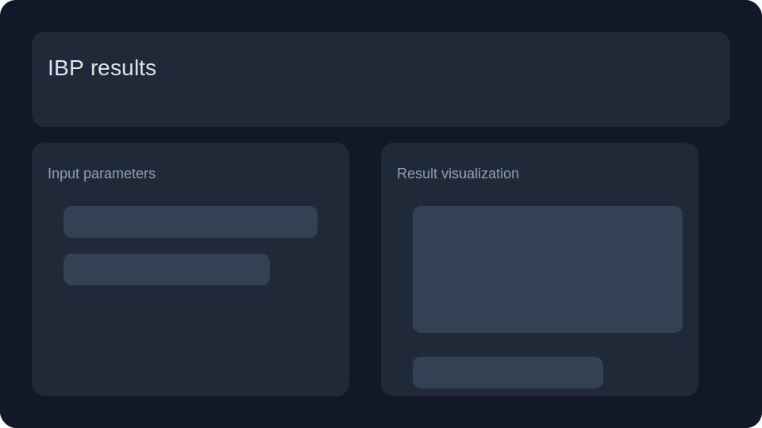

# Plasma-bubbles

Plasma-bubbles is a full-stack analytics platform for Ionospheric Bubble Probability (IBP) modeling.
It combines a FastAPI backend with a React frontend and supports interactive calculation, batch sweeps, experiment management, and shareable results.

## Key features

- User authentication and role-based access
- FastAPI backend with MongoDB persistence
- Ad-hoc IBP calculation endpoint
- Batch grid sweeps with Celery/Redis or fallback background execution
- Experiment creation, cloning, and history
- Job queue monitoring and downloadable results (CSV, NetCDF, Parquet)
- Shareable result links and public access
- React frontend using Tailwind, Radix UI, Plotly, and Recharts

## Repository structure

- `backend/` — FastAPI app, MongoDB integration, Celery worker, authentication, IBP routes
- `frontend/` — React application, pages, UI components, routing, dashboards
- `memory/`, `test_reports/`, `tests/` — project support files and test artifacts

## Tech stack

- **Backend**: Python, FastAPI, Motor (async MongoDB), Celery, Redis
- **Frontend**: React, Create React App, CRACO, Tailwind CSS, Radix UI
- **Visualization**: Plotly, Recharts
- **Infrastructure**: Docker, Docker Compose, GitHub Actions
- **Testing**: pytest, Jest, flake8
- **Security**: JWT, bcrypt, rate limiting

## Environment setup

### Option 1: Local development

1. Clone the repository:
   ```bash
   git clone https://github.com/safaryharold/Plasma-bubbles.git
   cd Plasma-bubbles
   ```

2. Create a backend virtual environment and install dependencies:
   ```bash
   cd backend
   python -m venv .venv
   source .venv/bin/activate
   pip install -r requirements.txt
   ```

3. Create a `.env` file in `backend/` with at least:
   ```env
   MONGO_URL=mongodb://localhost:27017
   DB_NAME=plasma_bubbles
   REDIS_URL=redis://localhost:6379/0
   CORS_ORIGINS=http://localhost:3000
   SECRET_KEY=your-secret-key-here
   ```

4. Start the backend API:
   ```bash
   cd backend
   uvicorn server:app --reload --host 0.0.0.0 --port 8000
   ```

5. Start the frontend app:
   ```bash
   cd frontend
   yarn install
   yarn start
   ```

6. Open the frontend in your browser:
   ```text
   http://localhost:3000
   ```

### Option 2: Docker deployment

Use Docker Compose for a complete development environment:

```bash
docker-compose up --build
```

This starts:
- MongoDB on port 27017
- Redis on port 6379
- Backend API on port 8000
- Frontend on port 3000

## Optional: start Celery worker

If you want background batch sweep processing through Redis/Celery:

```bash
cd backend
celery -A app.celery_app.celery worker --loglevel=info
```

If Redis is not available, batch jobs will automatically fall back to FastAPI `BackgroundTasks`.

## Testing

Run backend tests:
```bash
cd backend
pytest tests/
```

Run frontend tests:
```bash
cd frontend
yarn test
```

## CI/CD

This project uses GitHub Actions for continuous integration. The CI pipeline runs:
- Backend tests with pytest
- Backend linting with flake8
- Frontend tests with Jest

## Security features

- Strong password requirements (8+ chars, mixed case, numbers, special chars)
- Rate limiting on authentication endpoints (5 attempts per 15 minutes)
- JWT token-based authentication
- CORS protection
- Input validation with Pydantic models

## Project architecture

```
plasma-bubbles/
├── backend/                 # FastAPI backend
│   ├── app/
│   │   ├── auth.py         # Authentication & JWT
│   │   ├── db.py           # MongoDB connection
│   │   ├── models.py       # Pydantic models
│   │   ├── routes_*.py     # API endpoints
│   │   ├── celery_app.py   # Async task processing
│   │   └── ibp_service.py  # Core IBP calculations
│   ├── requirements.txt
│   └── server.py           # FastAPI app entrypoint
├── frontend/                # React frontend
│   ├── src/
│   │   ├── components/     # Reusable UI components
│   │   ├── pages/          # Page components
│   │   ├── context/        # React context providers
│   │   └── lib/            # Utilities
│   ├── package.json
│   └── public/
├── tests/                   # Backend tests
├── docs/                    # Documentation assets
├── .github/workflows/       # CI/CD pipelines
├── docker-compose.yml       # Docker orchestration
├── Dockerfile.*             # Container definitions
└── README.md
```

## Backend API overview

The backend serves API routes under `/api`:

- `/api/auth` — register, login, current user, logout
- `/api/ibp` — calculate IBP, create batch sweep jobs, list jobs, download outputs
- `/api/experiments` — create, list, clone, delete experiment definitions
- `/api/keys` — API key management
- `/api/share` — shareable result links
- `/api/admin` — admin-only management endpoints

## Screenshots

### Login screen


### Dashboard view


### IBP results and visualization


### Experiment management and batch job tracking


> The login screenshot above is a visual representation of your attached login page. Replace the SVG files in `docs/screenshots/` with real PNG/JPG screenshots once you want exact production visuals.

## Notes

- Do not commit `.env` or secret credentials.
- Add any local configuration and secrets to `.gitignore`.
- The backend creates MongoDB indexes automatically on startup.
- For production deployment, use environment variables for all secrets.
- The health endpoint (`/api/health`) provides status of database and Redis connections.

## License

This project does not include a license file. Add one if you want to publish or share the repository.
